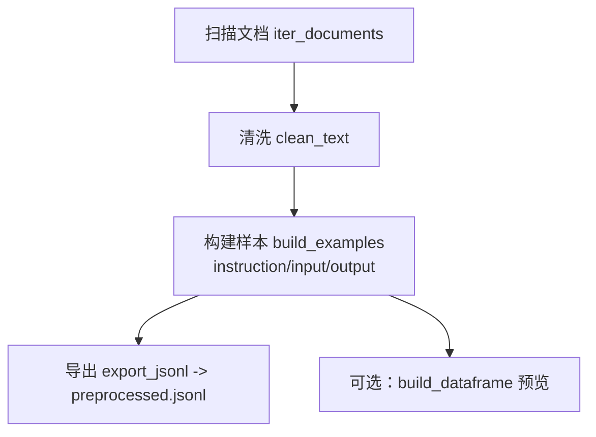

# 指令数据预处理与 Prompt 模板设计示例：使用说明与函数文档

> 版本：v1.0  
> 适用脚本：`lesson1/02_data_preprocess/data_pipeline.py`（本文档基于你提供的教学代码撰写）  
> 运行环境：Python ≥ 3.9；依赖 `pandas`（仅用于表格预览，可选）  
> 目标读者：希望快速把零散 Markdown/文本资料转为 **Instruction Tuning**（指令微调）格式 JSONL 的研发/教学场景。

---

## 目录
- [指令数据预处理与 Prompt 模板设计示例：使用说明与函数文档](#指令数据预处理与-prompt-模板设计示例使用说明与函数文档)
  - [目录](#目录)
  - [一、功能概述](#一功能概述)
  - [二、快速开始](#二快速开始)
    - [1) 安装依赖](#1-安装依赖)
    - [2) 目录准备](#2-目录准备)
    - [3) 运行脚本](#3-运行脚本)
  - [三、脚本主流程](#三脚本主流程)
  - [四、配置与数据结构](#四配置与数据结构)
    - [PreprocessConfig](#preprocessconfig)
    - [输出 JSONL 架构](#输出-jsonl-架构)
  - [五、函数与模块说明](#五函数与模块说明)
    - [`iter_documents`](#iter_documents)
    - [`clean_text`](#clean_text)
    - [`build_examples`](#build_examples)
    - [`export_jsonl`](#export_jsonl)
    - [`build_dataframe`](#build_dataframe)
  - [六、Prompt 模板设计要点](#六prompt-模板设计要点)
    - [形式化定义](#形式化定义)
    - [截断策略与信息密度](#截断策略与信息密度)
    - [常见模板示例](#常见模板示例)
  - [七、运行示例与产物](#七运行示例与产物)
  - [八、常见问题排查](#八常见问题排查)
  - [九、扩展建议](#九扩展建议)
  - [十、许可证](#十许可证)

---

## 一、功能概述

该教学脚本演示如何将本地 `markdown/txt` 文档整理为 **指令微调 JSONL** 数据。完整流程：
1. **扫描本地目录**：递归读取 `*.txt / *.md` 文件，拼接为原始语料；
2. **基础清洗**：合并多余空白、折叠重复换行；
3. **模板注入**：把清洗后的文本切片注入到 Prompt 模板，生成 `instruction / input / output` 三段式样本；
4. **导出 JSONL**：产出可直接用于 SFT/Instruction Tuning 的训练数据；
5. **可选预览**：用 `pandas` 构建 DataFrame 便于抽样检查。

> 示例默认在 `./sample_docs/` 内创建 `demo.txt`，确保即使没有真实语料也能跑通流程。

---

## 二、快速开始

### 1) 安装依赖
```bash
pip install pandas
```
> 若你不需要表格预览，可删除脚本中 `pandas` 的使用与导入。

### 2) 目录准备
```bash
mkdir -p sample_docs outputs
# 可把你的 *.md / *.txt 放在 sample_docs 下
```

### 3) 运行脚本
```bash
python lesson1/02_data_preprocess/data_pipeline.py
```
运行完成后将在 `./outputs/preprocessed.jsonl` 看到导出的样本。终端会打印样本数量与 DataFrame 头部。

---

## 三、脚本主流程



---

## 四、配置与数据结构

### PreprocessConfig

```python
@dataclass
class PreprocessConfig:
    data_dir: Path = Path("./sample_docs")
    output_path: Path = Path("./outputs/preprocessed.jsonl")
    template: str = "你是资深助教，请根据材料生成摘要。输入：{context}"
    min_length: int = 20
```
- **data_dir**：待扫描的语料目录，递归读取 `*.txt` 与 `*.md`；
- **output_path**：最终 JSONL 导出路径；
- **template**：Prompt 模板，务必包含 `{context}` 占位符；
- **min_length**：清洗后文本长度门限，小于该值的片段将被跳过（过滤噪声/短文本）。

### 输出 JSONL 架构

每行一个 JSON 对象，字段：
```json
{
  "instruction": "请阅读输入并生成摘要。",
  "input": "你是资深助教，请根据材料生成摘要。输入：<片段>",
  "output": "<参考摘要/目标输出子串>"
}
```
- **instruction**：固定任务描述，指导模型行为；
- **input**：将文本片段 `{context}` 注入模板后的完整提示；
- **output**：此处示范直接截取原文前 200 字作为“参考摘要”。实际项目建议改为**人工标注或更高质量压缩**。

---

## 五、函数与模块说明

### `iter_documents`

```python
def iter_documents(data_dir: Path) -> Iterable[str]:
    """遍历目录中的文本文件并返回内容。"""
```
- **输入**：`data_dir`（根目录）  
- **行为**：递归扫描 `*.txt` 与 `*.md`，逐个读取为 UTF-8 文本并 `yield`；
- **返回**：文本迭代器（字符串流）。  
- **注意**：如果需要控制读取顺序或文件大小过滤，可在此处扩展。

---

### `clean_text`

```python
def clean_text(text: str) -> str:
    """对文本执行基础清洗：去除多余空格与重复换行。"""
```
- **规则**：
  - `re.sub(r"\s+", " ", text)`：将连续空白折叠为单个空格；
  - `re.sub(r"(\n\s*)+", "\n", text)`：将多重（带空格）换行折叠为单换行；
- **返回**：`strip()` 后的清洗文本。  
- **提示**：对中英文混排可再加入全角/半角、标点标准化、HTML tag 过滤等。

---

### `build_examples`

```python
def build_examples(config: PreprocessConfig) -> List[dict]:
    """生成 instruction-tuning 训练样本。"""
```
- **流程**：
  1. 遍历 `iter_documents`；
  2. 调用 `clean_text`；
  3. 过滤 `len(cleaned) < min_length`；
  4. 取 `cleaned[:400]` 作为上下文片段，注入模板生成 `input`；
  5. 取 `cleaned[:200]` 作为“参考摘要”占位符填充 `output`；
  6. 固定 `instruction="请阅读输入并生成摘要。"`；
- **返回**：`List[dict]`，每个元素含 `instruction/input/output`。

> ⚠️ **为什么要截断？**  
> - 训练样本要尽量**短而信息密集**，有利于显存/显存&速度；  
> - 真实工程中应基于 **句子/段落/标题** 做语义切片，而非简单定长切片。

---

### `export_jsonl`

```python
def export_jsonl(examples: List[dict], output_path: Path) -> None:
    """将样本写入 JSONL 文件，便于后续微调。"""
```
- **行为**：创建上级目录（若不存在），逐行 `json.dumps(..., ensure_ascii=False)` 写出；
- **好处**：JSONL 便于流式加载、分布式切分与追加。

---

### `build_dataframe`

```python
def build_dataframe(examples: List[dict]) -> pd.DataFrame:
    """使用 pandas 构建可视化数据表。"""
```
- **行为**：把样本列表转为 DataFrame，便于 `head()` 抽样与列统计；
- **可选**：不需要此功能可以删掉 `pandas` 依赖与该函数。

---

## 六、Prompt 模板设计要点

### 形式化定义

设清洗后的上下文为 \( c \)，模板为字符串函数 \( T(\cdot) \)，则：
$$
\text{input} = T(c) = \text{template.replace(\{context\}, } c_{\le K} \text{)}
$$
其中 \( c_{\le K} \) 表示对上下文按长度/句子数进行截断。最终样本：
$$
\text{sample} = \{\text{instruction},\; \text{input},\; \text{output}\}.
$$

### 截断策略与信息密度

- **硬截断**：按字符/Token 长度裁剪（本示例为字符数）。实现简单但可能破坏语义；  
- **软截断**：以句子为单位（用句号/换行/正则），优先保留完整语义单元；  
- **信息密度**：摘要/指令任务建议控制在**几百字**内，避免噪声干扰模型学习。

### 常见模板示例

- **摘要**：`你是资深助教，请根据“材料”生成结构化摘要，含三点要约与一条结论。材料：{context}`  
- **改写**：`请在不改变含义的前提下，重写以下段落，使其更学术化。段落：{context}`  
- **抽取**：`从以下文本中抽取“方法/数据/结论”三要素，以 JSON 输出。文本：{context}`  
- **问答**：`请基于材料回答问题（中文作答、引用原文）。材料：{context}`

> 统一模板与稳定角色设定（system/user/assistant 或固定前缀）通常能提升泛化。

---

## 七、运行示例与产物

入口脚本：
```python
if __name__ == "__main__":
    config = PreprocessConfig()
    config.data_dir.mkdir(parents=True, exist_ok=True)
    sample_path = config.data_dir / "demo.txt"
    sample_path.write_text(
        "大模型微调的第一步是准备数据，需要把零散文档整理为结构化文本，并设计统一的 Prompt 模板。",
        encoding="utf-8",
    )

    examples = build_examples(config)
    export_jsonl(examples, config.output_path)

    df = build_dataframe(examples)
    print("预处理样本数量：", len(df))
    print(df.head())
```
- **首次运行**会自动在 `sample_docs/` 下写入一个 `demo.txt`，确保流程可复现；
- 输出文件：`outputs/preprocessed.jsonl`。

**JSONL 示例（前 1 行）：**
```json
{"instruction": "请阅读输入并生成摘要。", "input": "你是资深助教，请根据材料生成摘要。输入：大模型微调的第一步是准备数据，需要把零散文档整理为结构化文本，并设计统一的 Prompt 模板。", "output": "大模型微调的第一步是准备数据，需要把零散文档整理为结构化文本，并设计统一的 Prompt 模板。"}
```

---

## 八、常见问题排查

1. **没有读到任何文档**
   - 检查 `data_dir` 路径与文件扩展名（仅 `*.txt/*.md`）。  
   - 注意编码：确保是 UTF-8 或在读取时显式指定。

2. **样本太少**
   - 调小 `min_length`；  
   - 放入更多文档；  
   - 放宽清洗强度（不要把内容清空）。

3. **模板未替换 `{context}`**
   - 确认模板字符串确实包含 `{context}`。否则 `format` 会抛错或生成空上下文。

4. **pandas 相关错误**
   - 仅预览需要，可删除 `build_dataframe` 与所有 `pandas` 相关代码避免依赖。

5. **摘要质量不理想**
   - 本示例的 `output` 只是**占位**，建议替换为人工摘要或高质量压缩算法（如 TextRank/LSA/LLM 生成后再人工校对）。

---

## 九、扩展建议

- **更强清洗**：HTML 去标签、URL/邮箱过滤、正则黑白名单、全角半角统一；  
- **分割策略**：基于标题/段落/句子/窗口滑动的层级切分，控制重叠度；  
- **去重与相似度**：用 SimHash/MinHash/向量相似度去重；  
- **质量过滤**：长度分布、字符集检测、脏词/乱码过滤；  
- **多模板混合**：同一语料生成多任务样本（摘要、抽取、QA、改写）；  
- **标注管线**：结合标注平台或半自动摘要校对，产出高一致性 supervision。

---

## 十、许可证

- 若脚本未特别声明，沿用你项目的默认许可证；  
- 注意上游语料、模型与数据的许可与署名要求。

